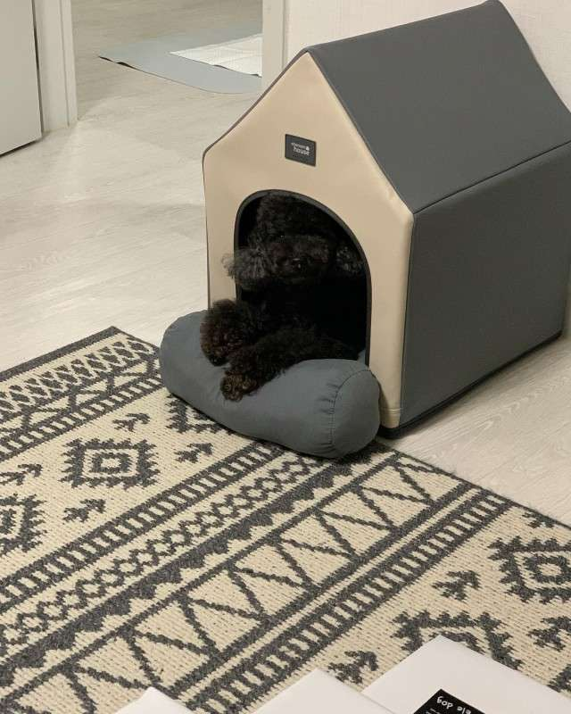

# 내일의 집

### 1. GNB

- 로그인 하지 않은 경우

``` html
<div class="button-group">
  <button class="gnb-icon-button is-seach lg-hidden" type="button" aria-label="검색창 열기 버튼">
    <i class="ic-search"></i>
  </button>
  <a class="gnb-icon-button is-cart" href="/" aria-label="장바구니로 이동">
    <i class="ic-cart"></i>
  </a>
  <div class="gnb-auth sm-hidden">
    <a href="/">로그인</a>
    <a href="/">회원가입</a>
  </div>
</div>
````
- 로그인 한 경우

``` html
<div class="button-group">
  <button class="gnb-icon-button is-seach lg-hidden" type="button" aria-label="검색창 열기 버튼">
    <i class="ic-search"></i>
  </button>
  <a class="gnb-icon-button sm-hidden" href="/" aria-label="스크랩북 페이지로 이동">
    <i class="ic-bookmark"></i>
  </a>
  <a class="gnb-icon-button sm-hidden" href="/" aria-label="내 소식 페이지로 이동">
    <i class="ic-bell"></i>
  </a>
  <a class="gnb-icon-button is-cart" href="/" aria-label="장바구니로 이동">
    <i class="ic-cart"></i>
    <strong class="badge">5</strong>
  </a>
  <button class="gnb-avatar-button sm-hidden" type="button" aria-label="마이메뉴 열기 버튼">
    <div class="avatar-32">
      
    </div>
  </button>
</div>
```

### 2. SIDEBAR

- 로그인 하지 않은 경우
```html
<aside class="sidebar sm-only">
    <header class="sidebar-header">
      <h1 class="logo">
        <a href="/"></a>
      </h1>
      <div class="sidebar-auth">
        <a class="btn-40 btn-outlined" href="/">로그인</a>
        <a class="btn-40 btn-primary" href="/">회원가입</a>
      </div>
    </header>

    <nav class="sidebar-nav">
      <h2 class="visually-hidden">메뉴</h2>
      <div class="drawer-menu">
        <button type="drawer-menu-button">
          <i class="ic-store" aria-hidden></i>
          스토어
          <i class="ic-chevron" aria-hidden></i>
        </button>
        <div class="drawer-menu-content">
          <ul class="drawer-menu-list">
            <li class="drawer-menu-item"><a href="/">스토어</a></li>
            <li class="drawer-menu-item"><a href="/">카테고리</a></li>
            <li class="drawer-menu-item"><a href="/">신혼가구</a></li>
            <li class="drawer-menu-item"><a href="/">
              기획전
              <i class="ic-new" lang="en" aria-label="New"></i>
            </a></li>
          </ul>
        </div>
      </div>
    </nav>
  </aside>
```

- 로그인 한 경우
```html
<aside class="sidebar sm-only">
    <header class="sidebar-header">
      <h1 class="logo">
        <a href="/"></a>
      </h1>
      <div class="sidebar-user">
        <a href="/">
          <div class="avatar-24">
            
          </div>
          <strong class="username">사달라그이하는절대받지않으오</strong>
        </a>
      </div>
    </header>

    <nav class="sidebar-nav">
      <h2 class="visually-hidden">메뉴</h2>
      <div class="drawer-menu">
        <button type="drawer-menu-button">
          <i class="ic-store" aria-hidden></i>
          스토어
          <i class="ic-chevron" aria-hidden></i>
        </button>
  
        <div class="drawer-menu-content">
          <ul class="drawer-menu-list">
            <li class="drawer-menu-item"><a href="/">스토어</a></li>
            <li class="drawer-menu-item"><a href="/">카테고리</a></li>
            <li class="drawer-menu-item"><a href="/">신혼가구</a></li>
            <li class="drawer-menu-item"><a href="/">
              기획전
              <i class="ic-new" lang="en" aria-label="New"></i>
            </a></li>
          </ul>
        </div>
      </div>
  
      <div class="sidebar-user-menu">
        <ul class="user-menu-list">
          <li class="user-menu-item"><a href="/">마이페이지</a></li>
          <li class="user-menu-item"><a href="/">나의 쇼핑</a></li>
          <li class="user-menu-item"><a href="/">스크랩북</a></li>
          <li class="user-menu-item"><a href="/">알림</a></li>
          <li class="user-menu-item"><a href="/">이벤트</a></li>
        </ul>
      </div>
    </nav>
  </aside>
```

### 2. REVIEW

- 리뷰가 있을 때

``` html
<section class="product-section product-review" id="product-review" role="tabpanel">
            <header class="product-section-header">
              <h1 class="title">리뷰</h1>
              <strong class="badge" aria-label="566개">566</strong>
              <a class="text-button" href="/">리뷰쓰기</a>
            </header>
            <div class="product-section-content">
              <div class="review-scoreboard">
                <div class="score-summary">
                  <strong class="average-score" aria-label="평점 4.8">4.8</strong>
                  <div class="star-rating">
                    <i class="ic-star is-active"></i>
                    <i class="ic-star is-active"></i>
                    <i class="ic-star is-active"></i>
                    <i class="ic-star is-active"></i>
                    <i class="ic-star is-active"></i>
                  </div>
                </div>
                <div class="score-detail">
                  <dl class="score-stats-list">
                    <div class="score-stats-item is-active">
                      <dt>5점</dt>
                      <dd>
                        <div class="bar-graph" aria-hidden>
                          <div class="active-bar"></div>
                        </div>
                        <strong class="count" aria-label="467 명">467</strong>
                      </dd>
                    </div>
                    <div class="score-stats-item">
                      <dt>4점</dt>
                      <dd>
                        <div class="bar-graph" aria-hidden>
                          <div class="active-bar"></div>
                        </div>
                        <strong class="count" aria-label="87 명">87</strong>
                      </dd>
                    </div>
                    <div class="score-stats-item">
                      <dt>3점</dt>
                      <dd>
                        <div class="bar-graph" aria-hidden>
                          <div class="active-bar"></div>
                        </div>
                        <strong class="count" aria-label="13 명">13</strong>
                      </dd>
                    </div>
                    <div class="score-stats-item">
                      <dt>2점</dt>
                      <dd>
                        <div class="bar-graph" aria-hidden>
                          <div class="active-bar"></div>
                        </div>
                        <strong class="count" aria-label="0 명">0</strong>
                      </dd>
                    </div>
                    <div class="score-stats-item">
                      <dt>1점</dt>
                      <dd>
                        <div class="bar-graph" aria-hidden>
                          <div class="active-bar"></div>
                        </div>
                        <strong class="count" aria-label="0 명">0</strong>
                      </dd>
                    </div>
                  </dl>

                </div>
              </div>

              <ol class="review-list">
                <li class="review-item">
                  <article class="review-card">
                    <header class="review-card-header">
                      <h3 class="visually-hidden">김버그 님이 작성한 리뷰</h3>
                      <a class="avatar-24" href="/" aria-label="김버그 님의 프로필로 이동">
                        
                      </a>
                      <div class="info">
                        <a class="username" href="/"><strong>김버그</strong></a>
                        <div class="detail">
                          <div class="star-rating-13" aria-label="5.0점 / 5.0점">
                            <i class="ic-star is-active"></i>
                            <i class="ic-star is-active"></i>
                            <i class="ic-star is-active"></i>
                            <i class="ic-star is-active"></i>
                            <i class="ic-star"></i>
                          </div>
                          <div class="misc">
                            <!-- mis: miscellaneous: 잡다한~ -->
                            <time datetime="2021-01-01">2022.01.01</time>
                            <span>내일의집 구매</span>
                          </div>
                        </div>
                      </div>
                    </header>
                    <!-- body 역할 -->
                    <div class="review-card-body">
                      <p>
                        집 전체를 데운다기보다는 틀어놓고 앞에 앉아있으면 따땃해지는 정도예요. 불 꺼놓고 난로 켜고 담요 덮은 채로 커피 마시면 아주 좋아요. 고양이도 좋아해요
                      </p>
                    </div>
                    <footer class="review-card-footer">
                      <button class="btn-outlined btn-32" type="button">도움이 돼요</button>
                      <p>
                        <strong><span>7</span>명</strong>에게 도움이 되었습니다.
                      </p>
                    </footer>
                  </article>
                </li>
                <!-- NOTE: 유저 이미지가 없는 경우 -->
                <li class="review-item">
                  <article class="review-card">
                    <header class="review-card-header">
                      <h3 class="visually-hidden">우유파이 님이 작성한 리뷰</h3>
                      <a class="avatar-24" href="/" aria-label="우유파이 님의 프로필로 이동"></a>
                      <div class="info">
                        <a class="username" href="/"><strong>우유파이</strong></a>
                        <div class="detail">
                          <div class="star-rating-13" aria-label="5.0점 / 5.0점">
                            <i class="ic-star is-active"></i>
                            <i class="ic-star is-active"></i>
                            <i class="ic-star is-active"></i>
                            <i class="ic-star is-active"></i>
                            <i class="ic-star is-active"></i>
                          </div>
                          <div class="misc">
                            <!-- mis: miscellaneous: 잡다한~ -->
                            <time datetime="2021-01-01">2022.01.01</time>
                            <span>내일의집 구매</span>
                          </div>
                        </div>
                      </div>
                    </header>
                    <!-- body 역할 -->
                    <div class="review-card-body">
                      <p>
                        작업실에서 손이 시려워서 책상 위에 올려서 쓸 걸로 골랐습니다! 아주 뜨끈하고 크기도 적당하고 민트 사고싶었지만 품절 ㅠ
                      </p>
                    </div>
                    <footer class="review-card-footer">
                      <button class="btn-outlined btn-32" type="button">도움이 돼요</button>
                      <p>
                        <strong><span>7</span>명</strong>에게 도움이 되었습니다.
                      </p>
                    </footer>
                  </article>
                </li>
                <!-- NOTE: 유저가 리뷰 이미지를 올린 경우 -->
                <li class="review-item">
                  <article class="review-card">
                    <header class="review-card-header">
                      <h3 class="visually-hidden">고영희 님이 작성한 리뷰</h3>
                      <a class="avatar-24" href="/" aria-label="고영희 님의 프로필로 이동"></a>
                      <div class="info">
                        <a class="username" href="/"><strong>고영희</strong></a>
                        <div class="detail">
                          <div class="star-rating-13" aria-label="5.0점 / 5.0점">
                            <i class="ic-star is-active"></i>
                            <i class="ic-star is-active"></i>
                            <i class="ic-star is-active"></i>
                            <i class="ic-star is-active"></i>
                            <i class="ic-star is-active"></i>
                          </div>
                          <div class="misc">
                            <!-- mis: miscellaneous: 잡다한~ -->
                            <time datetime="2021-01-01">2022.01.01</time>
                            <span>내일의집 구매</span>
                          </div>
                        </div>
                      </div>
                    </header>
                    <!-- body 역할 -->
                    <div class="review-card-body">
                      <div class="review-image">
                        
                      </div>
                      <p>
                        고양이가 좋아해요 ㅎㅎ 섬세한 온도조절이 안되는게 아쉽지만, 이 가격 이 디자인이면 만족할 수 밖에 없어요 :) 좋습니다!
                      </p>
                    </div>
                    <footer class="review-card-footer">
                      <button class="btn-outlined btn-32" type="button">도움이 돼요</button>
                      <p>
                        <strong><span>7</span>명</strong>에게 도움이 되었습니다.
                      </p>
                    </footer>
                  </article>
                </li>
                <!-- NOTE: 사용자가 도움됨을 체크, 도움됨 이 1개 이상일 때 -->
                <li class="review-item">
                  <article class="review-card">
                    <header class="review-card-header">
                      <h3 class="visually-hidden">쿠쿠 님이 작성한 리뷰</h3>
                      <a class="avatar-24" href="/" aria-label="쿠쿠 님의 프로필로 이동"></a>
                      <div class="info">
                        <a class="username" href="/"><strong>쿠쿠</strong></a>
                        <div class="detail">
                          <div class="star-rating-13" aria-label="5.0점 / 5.0점">
                            <i class="ic-star is-active"></i>
                            <i class="ic-star is-active"></i>
                            <i class="ic-star is-active"></i>
                            <i class="ic-star"></i>
                            <i class="ic-star"></i>
                          </div>
                          <div class="misc">
                            <!-- mis: miscellaneous: 잡다한~ -->
                            <time datetime="2021-01-01">2022.01.01</time>
                            <span>내일의집 구매</span>
                          </div>
                        </div>
                      </div>
                    </header>
                    <!-- body 역할 -->
                    <div class="review-card-body">
                      <p>
                        오래된 아파트 확장된 방이라 외풍이 너무 심해 급하게 구매했습니다! 예약배송이라 10일 가까이 기다렸는데 너무너무 만족스러워요~ :) 방이 큰 편이라 전체가 다 따뜻해지길 바라지도 않았고, 후기를 먼저 봤던터라 크게 기대를 안햇었는데 기대 이상입니다. 틀어놓으면 확실히 방 공기가 달라져요! 후끈!!! 까진 아니어도 차가운 공기가 따뜻해집니다~ 만족스러워요!!! 올 겨울 덕분에 떨지 않고 보낼 수 있을것 같습니당
                      </p>
                    </div>
                    <footer class="review-card-footer">
                      <button class="btn-primary btn-32" type="button">
                        <i class="ic-check" aria-hidden></i>
                        도움됨
                      </button>
                      <p>
                        <strong><span>1</span>명</strong>에게 도움이 되었습니다.
                      </p>
                    </footer>
                  </article>
                </li>
                <!-- NOTE: 사용자가 도움됨을 미체크, 도움됨 x -->
                <li class="review-item">
                  <article class="review-card">
                    <header class="review-card-header">
                      <h3 class="visually-hidden">빅토리아 님이 작성한 리뷰</h3>
                      <a class="avatar-24" href="/" aria-label="빅토리아 님의 프로필로 이동"></a>
                      <div class="info">
                        <a class="username" href="/"><strong>빅토리아</strong></a>
                        <div class="detail">
                          <div class="star-rating-13" aria-label="5.0점 / 5.0점">
                            <i class="ic-star is-active"></i>
                            <i class="ic-star is-active"></i>
                            <i class="ic-star"></i>
                            <i class="ic-star"></i>
                            <i class="ic-star"></i>
                          </div>
                          <div class="misc">
                            <!-- mis: miscellaneous: 잡다한~ -->
                            <time datetime="2021-01-01">2022.01.01</time>
                            <span>내일의집 구매</span>
                          </div>
                        </div>
                      </div>
                    </header>
                    <!-- body 역할 -->
                    <div class="review-card-body">
                      <p>가격대비 만족합니다</p>
                    </div>
                    <footer class="review-card-footer">
                      <button class="btn-outlined btn-32" type="button">도움이 돼요</button>
                    </footer>
                  </article>
                </li>
              </ol>

              <div class="pagination">
                <ol class="page-list">
                  <li class="page-item is-active"><a href="/">1</a></li>
                  <li class="page-item"><a href="/">2</a></li>
                  <li class="page-item"><a href="/">3</a></li>
                  <li class="page-item"><a href="/">4</a></li>
                  <li class="page-item"><a href="/">5</a></li>
                </ol>
                <button class="page-control page-next" type="button">
                  <i class="ic-chevron"></i>
                </button>
              </div>
            </div>
          </section>

```
- 리뷰가 없을 때

``` html
<section class="product-section product-review" id="product-review" role="tabpanel">
  <header class="product-section-header">
    <h1 class="title">리뷰</h1>
    <strong class="badge" aria-label="0개">0</strong>
    <a class="text-button" href="/">리뷰쓰기</a>
  </header>
  <div class="product-section-content">
    <p class="review-empty">
      첫 리뷰를 남겨주세요! <br />
      최대 <strong>500P</strong>를 드립니다.
    </p>
  </div>
</section>
```